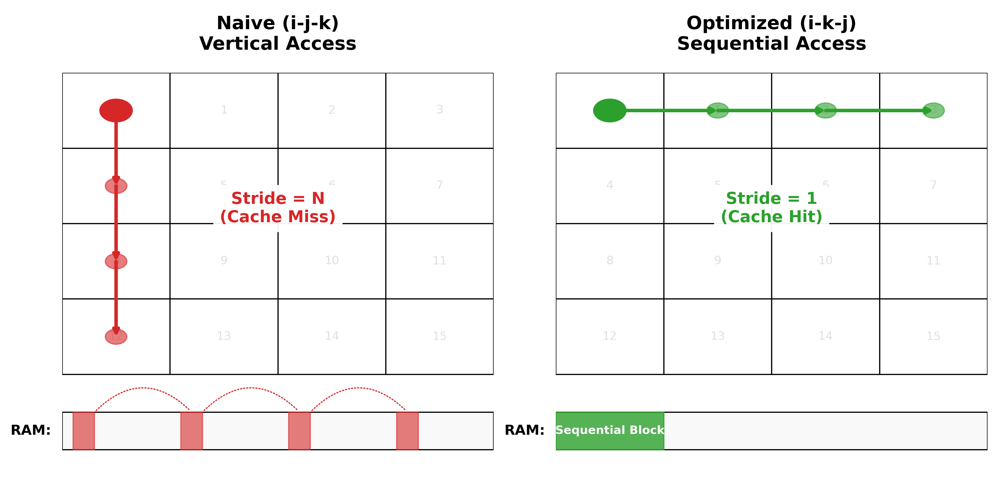
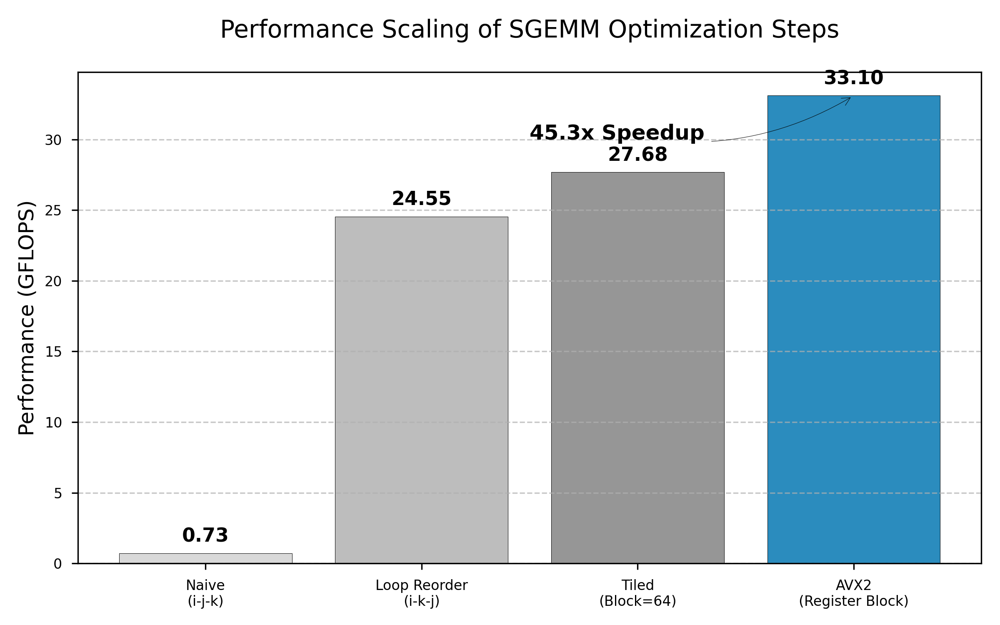

<h1 align="center" style="font-weight: bold; margin-bottom: 20px;">基于 x86 架构的单精度矩阵乘法性能优化微观机制研究</h1> 
 <b>乐豆芽</b>   2025级 兰州大学信息科学与工程学院 计算机4班 
  

**摘要:** 通用矩阵乘法（GEMM）是高性能计算领域的核心算子，其执行效率受到处理器存储层次结构与指令流水线的显著影响。本文以单精度矩阵乘法为例，在 x86_64 架构下系统探究了从朴素实现到高性能实现的优化路径。研究通过重排循环结构优化访存空间局部性，利用分块算法提升时间局部性，并结合 AVX2 指令集与寄存器分块技术掩盖指令延迟。实验结果表明，该系列优化策略可将计算性能提升约 45 倍，充分验证了软件算法适配硬件微观架构的重要性。

**关键词：** 矩阵乘法，存储层次结构，缓存优化，AVX2 指令集

  
 <b>le dou ya</b>   2025 level Lanzhou University School of Information Science and Engineering Computer Science Class 4 

**Abstract:** General Matrix Multiply (GEMM) is a core operator in the field of high-performance computing, and its execution efficiency is significantly affected by the processor memory hierarchy and instruction pipeline. This report systematically explores the optimization path from naive implementation to high-performance implementation under the x86_64 architecture using single-precision matrix multiplication as an example. The study optimizes memory access spatial locality by reordering loop structures, improves temporal locality using blocking algorithms, and masks instruction latency by combining the AVX2 instruction set with register blocking technology. Experimental results show that this series of optimization strategies can improve computational performance by approximately 45 times, fully verifying the importance of adapting software algorithms to hardware micro-architectures.

**Keywords:** GEMM, Memory Hierarchy, Cache Optimization, AVX2 Instruction Set

---

通用矩阵乘法（General Matrix Multiply, GEMM）定义为 $C \leftarrow \alpha AB + \beta C$，具有 $O(N^3)$ 的计算复杂度与 $O(N^2)$ 的数据访问量。在现代计算机体系结构中，处理器的浮点运算能力增长速度远超内存带宽增长速度，导致“存储墙”问题日益严峻。朴素的矩阵乘法实现往往受限于内存延迟与缓存缺失，难以发挥处理器的理论峰值性能。本文旨在通过算法层面的微观优化，包括循环变换、缓存分块及向量化指令调度，探究在通用处理器上逼近硬件性能极限的方法论。

## 1 存储访问模式的优化分析

### 1). 循环重排与空间局部性

在行主序（Row-major）存储的 C 语言环境中，朴素矩阵乘法通常采用 $i-j-k$ 的循环嵌套顺序。在该模式下，最内层循环对矩阵 $B$ 的访问方式为 $B[k][j]$。随着 $k$ 的迭代，内存地址产生跨步（Stride）为 $N$ 的跳跃访问。这种非连续访问导致 CPU 硬件预取机制失效，并引发大量转换后备缓冲器（TLB）的缺失。

通过将循环顺序调整为 $i-k-j$，计算逻辑转换为行向量的线性组合。此时，内层循环针对 $B$ 的第 $k$ 行与 $C$ 的第 $i$ 行进行连续读写。这种访问模式呈现出优异的空间局部性（Spatial Locality），使得 CPU 能够高效地将连续内存块加载至高速缓存行（Cache Line）中，显著提升内存带宽利用率。

在
  
   
  <b>图 1 朴素算法(左)与循环重排(右)的内存访问模式对比</b>

### 2). 缓存分块与时间局部性

尽管循环重排优化了访问流，但当矩阵规模 $N$ 远超 L1/L2 缓存容量时，数据无法在缓存中长期驻留。为解决容量失效问题，引入分块（Tiling/Blocking）算法。

将大矩阵划分为 $B_{size} \times B_{size}$ 的子块，确保参与运算的三个子块能够同时驻留于 L1 或 L2 缓存中。通过在缓存内反复复用这些数据块，最大限度地利用了时间局部性（Temporal Locality），从而降低对主存的访问频率。

## 2 指令级并行与向量化

### 1). AVX2 SIMD 指令集

单指令多数据（SIMD）技术允许处理器在单个时钟周期内处理多个数据点。Intel AVX2 指令集支持 256 位宽的 YMM 寄存器，可同时并行处理 8 个单精度浮点数。然而，简单的向量化替换并未能达到预期性能，主要原因在于指令流水线的停顿（Stall）。

### 2). 寄存器分块与延迟掩盖

现代 CPU 执行融合乘加（FMA）指令通常需要 4-5 个时钟周期的延迟。若指令间存在强数据依赖（如连续累加至同一寄存器），流水线将产生空泡。本文采用寄存器分块（Register Blocking）策略，在最内层微内核中展开计算，一次迭代计算 $4 \times 8 = 32$ 个浮点结果。由于 4 条 FMA 指令累加至不同的寄存器，它们之间无数据依赖，可被 CPU 并发发射执行，从而有效掩盖了浮点运算的延迟。

## 3 实验设计与实施过程

为了准确评估不同优化策略的性能收益，本研究设计了一套标准化的实验流程，涵盖代码实现、正确性校验及性能度量三个阶段。

### 1). 核心算法实现与内存管理

实验代码采用 C 语言编写，严格遵循模块化设计原则。为了适配 AVX2 指令集对内存地址对齐的要求，矩阵内存分配摒弃了普通的 `malloc`，转而使用 `posix_memalign` 函数将内存地址对齐到 32 字节边界。这确保了数据加载到 YMM 寄存器时可以使用高效的 `vmovaps`（对齐加载）指令，而非性能较差的 `vmovups`（未对齐加载）指令。此外，为了模拟真实的 HPC 场景，所有矩阵数据均初始化为随机单精度浮点数。

### 2). 结果正确性校验 (Verification)

性能优化不能以牺牲计算准确度为代价。为了确保优化后的代码没有算错，本实验将朴素算法（Naive Implementation）的计算结果作为“标准答案”。

每当运行一种新的优化算法（如循环重排、AVX2 指令集等）后，程序都会自动将其计算结果与“标准答案”进行逐个元素的比对。考虑到浮点数运算存在微小的精度差异，本实验采用最大绝对误差来衡量准确性：

$$
\text{Error} = \max | \text{标准值} - \text{优化值} |
$$

只有当所有元素的最大误差都小于 $10^{-5}$（即 0.00001）时，才认定该优化是正确的，否则视为计算错误，不予记录成绩。

### 3). 计时机制与误差控制

为了获取微秒级的计时精度，实验在 Linux 环境下调用 `clock_gettime(CLOCK_MONOTONIC, &ts)` 接口进行耗时测量，避免了系统时间修改带来的干扰。

考虑到操作系统调度抖动及冷启动（Cold Start）导致的缓存未命中影响，实验对每组优化策略采用了“热身+多次测量取平均”的机制：

1.  **热身阶段（Warm-up）：** 先空跑 5 次核心计算函数，使指令缓存（I-Cache）和数据缓存（D-Cache）进入活跃状态。
2.  **测量阶段：** 连续执行 20 次并记录总耗时，取平均值计算 GFLOPS。

计算公式为：

$$
\text{性能 (GFLOPS)} = \frac{\text{总浮点运算次数}}{\text{耗时 (秒)} \times 10^9} = \frac{2 \times N^3}{\text{耗时} \times 10^9}
$$

**公式说明：**
1.  **工作总量 ($2 \times N^3$)：** 矩阵乘法的核心是在三层循环（$N \times N \times N$）中执行乘加运算 ($c = c + a \times b$)。每次循环包含 **1 次乘法**和 **1 次加法**，共 2 次浮点运算。因此，总运算量为 $2N^3$ 次。
2.  **单位换算 ($10^9$)：** GFLOPS 的单位是“十亿次运算每秒”，因此需要除以 $10^9$ 进行单位换算。
## 4 实验结果与分析

### 1). 实验环境

实验平台为 Intel Core i7 处理器（支持 AVX2/FMA），操作系统为 Ubuntu 24.04 LTS。编译器配置为 GCC 11.4.0，开启 `-O3 -mavx2 -mfma` 优化选项。测试对象为 $N=1024$ 的单精度浮点矩阵。

### 2). 性能数据对比

各优化阶段性能数据如表 1 所示。

**表 1 不同优化策略下的性能对比**

| 优化策略                     | 核心机制    | 性能 (GFLOPS) | 加速比       |
| :----------------------- | :------ | :---------- | :-------- |
| Naive (朴素实现)             | 基准对照    | 0.73        | 1.0x      |
| Loop Reorder (循环重排)      | 空间局部性优化 | 24.55       | 33.6x     |
| Tiling (缓存分块)            | 时间局部性优化 | 27.68       | 37.9x     |
| AVX2 + Register Blocking | 指令级并行优化 | **33.10**   | **45.3x** |

    
 <b>图 1 朴素算法(左)与循环重排(右)的内存访问模式对比</b> 
 

数据表明，仅通过循环重排优化访存模式，性能即获得了 33 倍的提升，这证实了在内存受限型应用中，访存效率是性能的首要瓶颈。而在计算受限阶段，通过 AVX2 寄存器分块技术，进一步挖掘了约 20% 的性能增益，使程序逼近硬件理论峰值。

## 5 结论

高性能计算的本质在于软件算法与硬件架构的深度适配。本文的研究揭示了三个关键结论：其一，连续的内存访问模式是性能优化的基石；其二，缓存分块技术能有效突破“存储墙”限制；其三，寄存器级的指令调度是发挥现代超标量处理器性能的关键。这一微观优化方法论对于深度学习算子及其他科学计算应用的开发具有普适的指导意义。

## 参考文献

[1] Goto K, Van De Geijn R A. Anatomy of high-performance matrix multiplication[J]. ACM Transactions on Mathematical Software (TOMS), 2008, 34(3): 1-25.
[2] Hennessy J L, Patterson D A. Computer architecture: a quantitative approach[M]. Elsevier, 2011.
[3] Intel Corporation. Intel® 64 and IA-32 Architectures Optimization Reference Manual[Z]. 2023.

